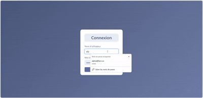

# Portfolio du Projet

## Carnet de Contacts

**Description synthétique :**
Carnet de contacts web permettant d'ajouter, rechercher et afficher des contacts (prénom, nom, téléphone, email) avec authentification sécurisée.

**Image :**

**GIF démonstration :**

**Lien GitHub :**
[https://github.com/votre-utilisateur/carnet-contacts](https://github.com/votre-utilisateur/carnet-contacts)

**Technologies utilisées :**
- PHP
- HTML5 / CSS3
- Bootstrap 5
- CSV (stockage)

---

<!-- Dupliquez ce modèle pour chaque projet de votre portfolio -->
